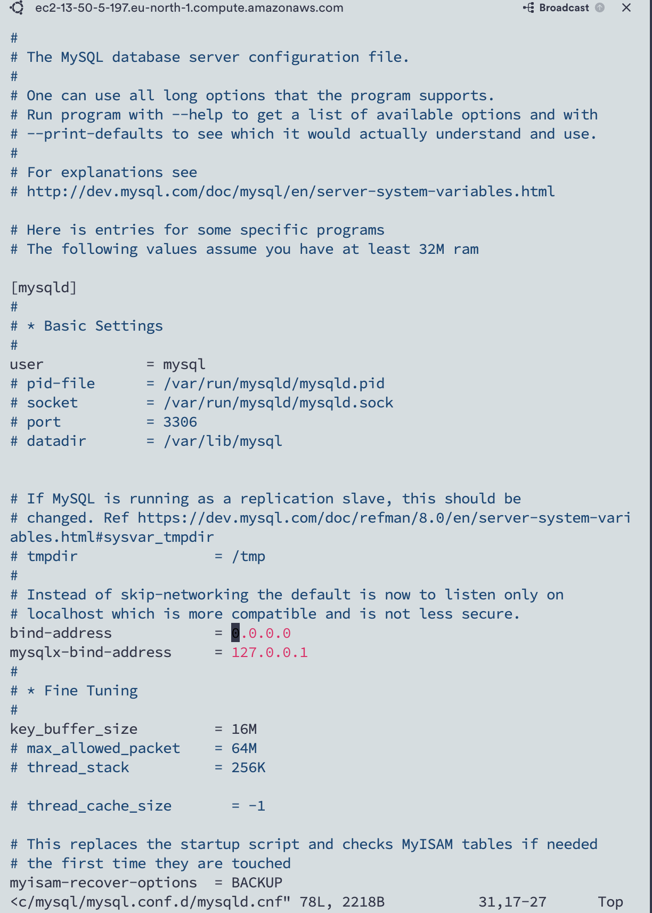
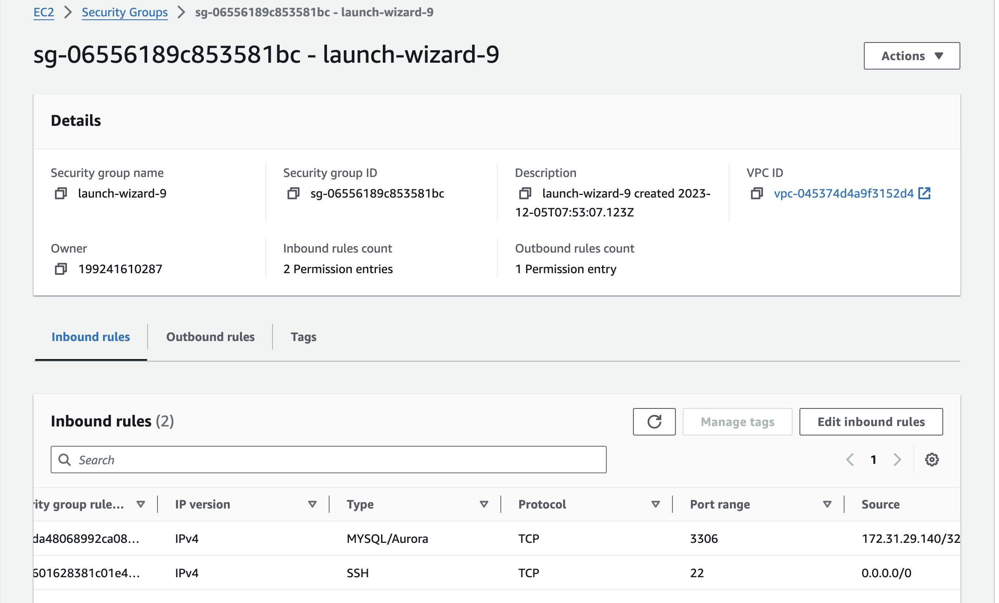

# **Web Server and Database Server Interaction:**

+ Step 1 

>The Web Server plays the role of a "Client" in this scenario.

>It connects to a Database (DB) Server, which could be powered by MySQL, MongoDB, Oracle, SQL Server, or other technologies.

>Communication between the Web Server and the DB Server occurs over a Local Network. Alternatively, it could take place over the Internet, though it's common to have both servers close to each other in a local network.

+ Step 2

### **Web Stack Architecture:**

>The diagram illustrates a typical Web Stack architecture, a generic structure used in various projects (LAMP, LEMP, MEAN, MERN).

>This architecture is flexible and can be implemented with different combinations of Web and DB servers, supporting projects ranging from small Single-page applications (SPA) to large, complex portals.

>The example output provides information about the IP address (160.153.133.153) and port (80) used in the communication.
Further details about IP addresses and ports will be covered in networking-related projects.

+ Step 3

### **Real Example - LAMP Website:**

>Consider a real-world example like `www.propitixhomes.com` , which is a LAMP website.

>This website can be hosted anywhere globally, and users from any part of the world can access it over the Internet.Prequisites

+ Step 4

### **Client-Server Interaction in Action:**

>When you type www.propitixhomes.com into your browser, your browser acts as the "Client."

>The browser sends a request to the remote server (www.propitixhomes.com) and expects a response in return.

+ Step 5

### **Demonstrating Client-Server Communication with Curl:**

>Open your Ubuntu or Windows terminal.

>Execute the following curl command:

`$ curl -Iv www.propitixhomes.com`

>If your Ubuntu system lacks 'curl,' you can install it with sudo apt install curl.

+ Step 6

### **Observing the Output:**

>Your terminal acts as the client, and www.propitixhomes.com serves as the server.

>Examine the response from the remote server in the output.

>Notice that the requests from the specified URL are served by a computer with the IP address 160.153.133.153 on port 80.

+ Step 7

### **IP Addresses and Ports:**

>The example output provides information about the IP address (160.153.133.153) and port (80) used in the communication.

>Further details about IP addresses and ports will be covered in networking-related projects.

## **_Implementing a Client-Server Architecture using the MySQL Database Management System (DBMS)_**

+ STEP 1

**Server Configuration**

> Set up two Linux-based virtual servers, naming them `MySQL Server` (Server A) and `MySQL Client` (Server B). This can be accomplished by creating EC2 instances in AWS.

> Note: MySQL Server and MySQL Client are given specific server names for clarity.

+ STEP 2

**Software Installation**

> On the `MySQL Server` (Server A), install the MySQL Server software. An interesting fact is that MySQL is an open-source relational database management system, with its name derived from the co-founder Michael Widenius's daughter ('My') and 'SQL' representing Structured Query Language.

> On the 'MySQL Client' (Server B), install the MySQL Client software.

+ STEP 3

**Network Configuration**

> By default, both EC2 virtual servers are placed within the same local virtual network. This configuration enables communication between them using local IP addresses.

> To establish a connection from the `MySQL Client` to the `MySQL Server`,' utilize the local IP address of the `MySQL Server`

>MySQL Server operates on TCP port 3306 by default. To enable communication, create a new entry in the 'Inbound rules' of the `MySQL Server` Security Group, opening TCP port 3306.

+ STEP 4

**Security Considerations**

> For enhanced security, it is crucial not to permit all IP addresses to access the `MySQL Server`. Instead, restrict access to only the specific local IP address of the `MySQL Client`. This measure ensures that communication is limited to the intended client, adding an extra layer of security to the architecture.

+ STEP 5

> To enable MySQL server to accept connections from remote hosts, you may need to adjust the server configuration. Follow the steps below

> Open the MySQL configuration file using a text editor. In this example, we use the `vi` editor

`sudo vi /etc/mysql/mysql.conf.d/mysqld.cnf`

> Inside the configuration file, locate the line that begins with _bind-address_ and change the value from `127.0.0.1` to `0.0.0.0`. 
This modification allows the MySQL server to listen for connections from any IP address

> Save the changes and exit the text editor. In _vi_, you can do this by pressing Esc, typing **:wq**, and then pressing _Enter_

> Open the terminal on your Linux client machine. Access MySQL Client:

> Launch the MySQL client by typing the following command and pressing Enter 

`mysql -u your_username -p`

> After entering the password, connect to the remote MySQL server using the following command 

`mysql -h remote_server_ip -u your_username -p`

> Enter Password:

> You'll be prompted to enter the password for your MySQL user on the remote server.

_Successful Connection_

> If the connection is successful, you will see the MySQL prompt, indicating that you are now connected to the remote MySQL server.